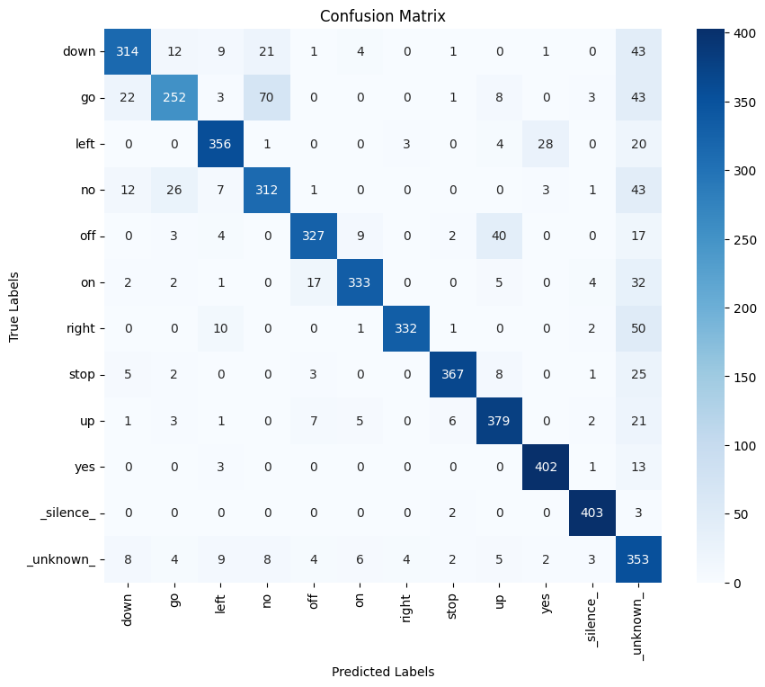

# Efficient Keyword Spotting for LED Control with TensorFlow Lite for Microcontrollers 💡🎤

[](https://opensource.org/licenses/MIT)

This project details the design, development, and evaluation of an audio keyword spotting (KWS) system capable of recognizing a small vocabulary of spoken commands. The system is optimized for deployment on resource-constrained microcontrollers (MCUs) like the Arduino Nano 33 BLE Sense using TensorFlow Lite for Microcontrollers (TFLM). The final INT8 quantized model achieves ~88% test accuracy with a remarkable size of ~33KB. The goal was to classify short audio commands from a predefined vocabulary of 12 words (10 commands, silence, unknown). The recognized commands are then mapped to control the state and color of RGB LEDs connected to an Arduino Nano 33 BLE Sense, demonstrating a practical application of embedded machine learning.

**Key Advantages of this Edge AI Approach:**

- **Offline Operation Potential:** The final TFLM model runs on the MCU, independent of an internet connection for inference.
- **Enhanced Privacy:** With on-device inference, sensitive audio data doesn't need to be sent to cloud servers.
- **Low Latency:** Local inference on the MCU enables fast response times.

---

## Table of Contents

- [Dataset & Preprocessing](#-dataset--preprocessing)
- [Methodology & Pipeline](#️-methodology--pipeline)
- [Technology Stack](#-technology-stack)
- [Setup & Installation](#-setup--installation)
- [How to Run](#️-how-to-run)
  - [Jupyter Notebook (Training & Conversion)](#jupyter-notebook-training--conversion)
  - [Python Sender & Arduino Sketch (Deployment Demo)](#python-sender--arduino-sketch-deployment-demo)
- [Project Structure](#-project-structure)
- [Results & Performance](#-results--performance)
- [MCU Deployment Implementation](#-mcu-deployment-implementation)
- [Challenges Encountered & Future Work](#-challenges-encountered--future-work)
- [License](#-license)
- [Acknowledgements](#-acknowledgements)

---

## Dataset & Preprocessing

- **Source:** Google Speech Commands Dataset **v0.0.3** (via TensorFlow Datasets). This version provides 12 pre-defined classes: 10 core commands (`down`, `go`, `left`, `no`, `off`, `on`, `right`, `stop`, `up`, `yes`), `_silence_`, and `_unknown_`.
- **Challenge:** The 'train' split exhibited severe class imbalance (e.g., `_unknown_`: ~54k samples, `_silence_`: ~670 samples, commands: ~3k each).
- **Solution - Data Rebalancing (Training Set Only):**
  - `_unknown_` class was undersampled (e.g., to ~10,000 samples).
  - `_silence_` class was oversampled (e.g., repeated to ~1,300-3,000 samples).
  - Command words were retained.
  - This resulted in a more balanced training set of ~42,000 samples. Validation and test sets were kept in their natural imbalanced state.
- **Feature Extraction (MFCCs):**
  - Audio (16kHz) was processed to extract Mel-Frequency Cepstral Coefficients.
  - Final parameters used with `librosa` (Python) for training the best model:
    - `n_mfcc`: 13
    - `n_mels`: **40** (Crucial change after identifying on-device memory constraints for `ArduinoMFCC`)
    - `n_fft`: 512 (32ms window)
    - `hop_length`: 160 (10ms hop)
    - Window: Hann
    - This resulted in a `(13, 100, 1)` input shape per 1-second audio clip for the CNN.
  - Audio was normalized to `[-1.0, 1.0]` before MFCC calculation.

## Methodology & Pipeline

1.  **Data Loading & Preprocessing (Python):** Loaded audio using `tensorflow_datasets`, applied custom data rebalancing for the training set, normalized audio, and extracted MFCCs using `librosa`.
2.  **Model Architecture (Keras):** A compact CNN (with Dropout layers) using `Conv2D`, `MaxPooling2D`, `GlobalAveragePooling2D`, and `Dense` layers was developed.
3.  **Training (Python/Keras):** Trained using Adam optimizer, `sparse_categorical_crossentropy` loss, and callbacks (`ModelCheckpoint`, `EarlyStopping`, `ReduceLROnPlateau`). Seeds were set for reproducibility.
4.  **Evaluation (Python/Keras & TFLite):** Full evaluation with accuracy, classification reports, and confusion matrices for the Keras model and the subsequently converted TFLite INT8 model.
5.  **TFLM Conversion (Python, performed on Colab):**
    - Best Keras model converted to Float32 TFLite.
    - Float32 TFLite model quantized to INT8 using post-training quantization with a representative dataset (300 samples from the training set). `target_spec.supported_ops` set to `[tf.lite.OpsSet.TFLITE_BUILTINS_INT8]`.
6.  **C Array Generation:** The INT8 TFLite model was converted to a C byte array using `xxd` for embedding into the Arduino sketch.
7.  **MCU Sketch Development (Arduino C++):**
    - Developed sketch for Arduino Nano 33 BLE Sense.
    - Implemented serial communication protocol ('S'/'R' handshake) to receive quantized INT8 MFCC data from PC.
    - Loaded TFLM model from C array, set up interpreter and tensor arena.
    - Performed inference on received MFCCs.
    - Controlled RGB LEDs based on recognized keywords above a confidence threshold.
8.  **PC-MCU Interaction Script (Python):**
    - Developed a Python script to:
      - Record live audio from PC mic OR load pre-saved keyword MFCCs (`.npy` files).
      - Calculate MFCCs (`librosa`) for live audio.
      - Quantize float32 MFCCs to INT8 using model's input scale/zero-point.
      - Send data to Arduino via Serial and display Arduino's response.

## Technology Stack

- **Programming Languages:** Python 3.11, C++ (for Arduino)
- **Core ML Libraries:** TensorFlow (v2.16.2), Keras API
- **Audio Processing (Python):** Librosa, SoundDevice (for live recording)
- **Data Handling (Python):** NumPy
- **Plotting & Visualization (Python):** Matplotlib, Seaborn
- **Dataset Management (Python):** TensorFlow Datasets
- **MCU Development:** Arduino IDE, `Chirale_TensorFlowLite`
- **Serial Communication (Python):** PySerial

## Setup & Installation

1.  **Clone the repository:**

    ```bash
    git clone https://github.com/anacletu/tflm-keyword-spotting-led.git
    cd tflm-keyword-spotting-led
    ```

2.  **Create and activate a Python virtual environment (recommended):**

    ```bash
    # Ensure Python 3.11 is available
    python3.11 -m venv venv
    source venv/bin/activate  # On macOS/Linux
    # venv\Scripts\activate # On Windows
    ```

3.  **Install Python dependencies:**

    ```bash
    pip install -r requirements.txt
    ```

    - **System requirements for Python audio:**
      - `sounddevice` may require system audio libraries (e.g., PortAudio: `brew install portaudio` on macOS, `sudo apt-get install libportaudio2 libasound-dev` on Debian/Ubuntu).
      - `librosa` (via `soundfile`) may require `libsndfile` (`brew install libsndfile` or `sudo apt-get install libsndfile1`).

4.  **TensorFlow Installation Note:**
    The `requirements.txt` should be configured for your system (e.g., Apple Silicon `tensorflow-macos` and `tensorflow-metal`, or standard `tensorflow` for other systems).

5.  **Arduino IDE Setup:**
    - Install Arduino IDE.
    - Install "Arduino Mbed OS Nano Boards" core via Boards Manager.
    - Install the TFLM library (e.g., `Chirale_TensorFlowLite` via ZIP or a working TFLM solution) via Library Manager or by adding the library to the Arduino libraries folder.
    - Place `model_data.h`, `model_data.cc`, `model_settings.h`, `model_settings.cpp` in your Arduino sketch folder.

## How to Run

### Jupyter Notebook (Training & Initial TFLite Conversion)

1.  Open the main Jupyter Notebook (e.g., in `notebooks/`).
2.  Run cells sequentially to perform data loading, preprocessing, model training, evaluation, and TFLite conversion. The notebook also contains code to save specific MFCC samples as `.npy` files to `utils/test_samples_for_arduino/`.

### Python Sender & Arduino Sketch (Deployment Demo)

1.  **Arduino:**

    - Open the Arduino sketch (e.g., `arduino_sketch_files/KeywordSpotterNano_SERIAL/KeywordSpotterNano.ino`) in the Arduino IDE.
    - Ensure `model_data.cc` and `model_settings.h/.cpp` are correctly populated and in the sketch folder.
    - Select "Arduino Nano 33 BLE" board and the correct port.
    - Compile and upload the sketch to your Arduino Nano 33 BLE Sense.
    - (Optional) Open Arduino Serial Monitor briefly to check setup messages, then CLOSE IT.

2.  **Python Sender Script:**

    - Navigate to the directory containing `send_mfcc_to_arduino.py` (e.g., `utils/`).
    - Update `SERIAL_PORT` in the script if needed.
    - Run from terminal:

      ```bash
      # To send a pre-saved MFCC sample (e.g., for "on")
      python send_mfcc_to_arduino.py on

      # To record live audio from PC mic, then process and send
      python send_mfcc_to_arduino.py record
      # (Speak keyword when prompted)
      ```

    - Observe the Python console for Arduino's responses and the LEDs on the Arduino board.

## Project Structure

```
tflm-keyword-spotting-led/
├── notebooks/ # Jupyter notebook for development
├── data/ # (Potentially for storing raw dataset if not using TFDS default path)
├── models/ # Saved Keras models (.keras)
├── tflite_models/ # Saved TFLite models (.tflite)
├── arduino_sketch_files/ # Arduino deployment code
│ └── KeywordSpotterNano_SERIAL/
│   ├── KeywordSpotterNano_SERIAL.ino
│   ├── model_data.h
│   ├── model_data.cc
│   ├── model_settings.h
│   └── model_settings.cpp
├── utils/ # Utility scripts
│ ├── send_mfcc_to_arduino.py
│ └── test_samples_for_arduino/ # .npy files of pre-processed MFCCs
│   ├── sample_mfcc_on.npy
│   └── ...
├── requirements.txt # Python dependencies
├── .gitignore
├── LICENSE # Project license file
└── README.md # This file
```

## Results & Performance

- **Dataset Rebalancing:** Crucial for overcoming bias towards the `_unknown_` class. Training set composition: `~30k` total command words (10 classes), `~10k` `_unknown_` samples (undersampled), `~1.3k` `_silence_` samples (oversampled).
- **Keras Model (CNN with GlobalAveragePooling & Dropout):**
  - Trained on rebalanced data with MFCCs (13 coeffs from 40 Mels, 100 frames).
  - **Test Accuracy (evaluated on naturally imbalanced test set): ~88%**.
  - Saved as: `models/final_model_test_acc_0.88.keras` (Size: 354.35 KB)
- **Float32 TFLite Model:**
  - Size: 104.43 KB
  - Test Accuracy (Python TFLite interpreter): ~87.9%
- **INT8 Quantized TFLite Model:**
  - Representative dataset: 300 samples from training data.
  - **Size: 33.57 KB** (~67.9% reduction from Float32 TFLite)
  - **Test Accuracy (Python TFLite interpreter): ~87.5%** (showing minimal to no accuracy loss).
- **C Array for MCU:**
  - `model_data.cc` generated from INT8 TFLite model. Size on disk: ~207 KB (C syntax overhead). Actual model data in Flash: ~33.57 KB.

<br>



## MCU Deployment Implementation

The final INT8 quantized TFLite model (`~33KB`) was deployed to an **Arduino Nano 33 BLE Sense**.

- **Method:** The PC handles audio input (live via microphone or from pre-saved MFCCs) and feature processing (MFCC calculation using `librosa`, then quantization to INT8). These INT8 MFCC bytes are sent to the Arduino via Serial.
- **Arduino Sketch:**
  - Receives INT8 MFCC data using a robust 'S'/'R' (Start/Ready) handshake protocol.
  - Performs inference using the TFLM interpreter.
  - Identifies the keyword with the highest score above a confidence threshold (`g_recognition_threshold_int8` in `model_settings.h`, calibrated to ~70% float probability).
  - Controls connected Red, Green, and Blue LEDs based on recognized keywords (e.g., "up" -> Red, "on" -> Green).
  - Sends acknowledgment (ACK_OK, ACK_FAIL, ACK_LOW) and prediction back to PC.
- **Performance:** Inference duration on Nano 33 BLE Sense for the INT8 model was observed to be ~300-350ms (can be further optimized). The `kTensorArenaSize` was set to 45KB.
- **Outcome:** The system successfully demonstrates keyword recognition on the MCU with visual LED feedback.

<br>

https://github.com/user-attachments/assets/f9376b33-dca8-4acf-a709-547689b0689e

## Challenges Encountered & Future Work

- **Challenges:**

  - **Class Imbalance:** The original Speech Commands v0.0.3 `_unknown_` class was massive, requiring significant undersampling for effective training. `_silence_` required oversampling.
  - **Training Stability:** Initial training runs (especially with class weights on the original imbalanced set) were unstable. Iterative adjustments to learning rate, data rebalancing, and model architecture (using Global Average Pooling and Dropout) were key.
  - **Local TFLite Conversion:** Encountered persistent kernel crashes on macOS M1 when converting Keras to TFLite. This was pragmatically resolved by performing the TFLite conversion on Google Colab.
  - **Serial Data Transfer to MCU:** Initial attempts to send MFCC data to Arduino resulted in incomplete data reception. This was resolved by implementing a paced, chunked sending strategy from Python and an 'S'/'R' handshake protocol.
  - **(Briefly) On-Device MFCC Attempts:** Initial exploration of on-device MFCC libraries (`ArduinoMFCC`) highlighted significant challenges in matching `librosa`'s feature output numerically and potential memory/performance issues on the MCU, leading to the strategic decision to focus on PC-based MFCCs for this project's demo.

- **Future Work:**
  - **Robust On-Device Feature Extraction:** Integrate and optimize an efficient C++ MFCC library (like a refined `ArduinoMFCC`, TFLM Microfrontend + DCT, or `EloquentTinyML`) on the Nano for a fully standalone system. This would involve retraining the model on features generated by that specific on-device library to ensure numerical consistency.
  - **Voice Activity Detection (VAD):** Implement VAD on the MCU (or PC for current setup) to process audio only when speech is detected, improving responsiveness and power efficiency.
  - **Model Optimization:** Explore more advanced TFLM-specific model architectures or further compression (e.g., Quantization-Aware Training, pruning) for even smaller/faster models.
  - **Noise Robustness:** Incorporate data augmentation with various noise types during training.
  - **Expand Vocabulary & Application:** Add more keywords and more complex LED control patterns or other MCU actions.

## License

This project is licensed under the MIT License - see the `LICENSE` file for details.

## Acknowledgements

- **Google Speech Commands Dataset** creators for providing the audio data.
- The **TensorFlow and TensorFlow Lite development teams** for their open-source machine learning libraries.
- Libraries used: `Librosa`, `SoundDevice`, `PySerial`, `NumPy`, `Matplotlib`, `Seaborn`.
- The **Arduino community** and developers of MCU libraries.
